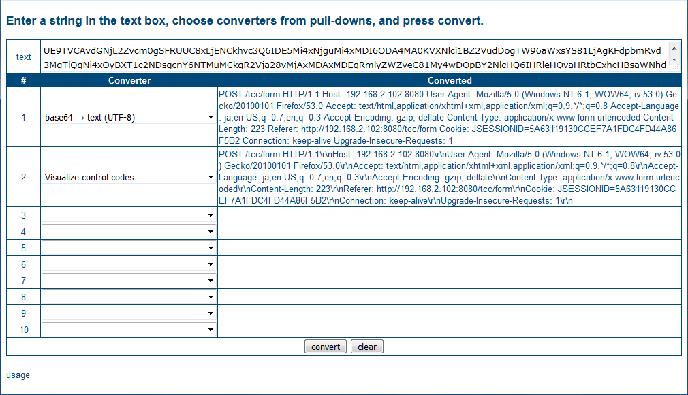

## Text Conversion Chain
This servlet is a collection of text converters.

Just as you chain commands with pipe in a UNIX shell to pass inputs around, you can apply multiple converters to the source string one by one.

### Example
Let's decode this Base64 text.

    UE9TVCAvdGNjL2Zvcm0gSFRUUC8xLjENCkhvc3Q6IDE5Mi4xNjguMi4xMDI6ODA4MA0KVXNlci1BZ2VudDogTW96aWxsYS81LjAgKFdpbmRvd3MgTlQgNi4xOyBXT1c2NDsgcnY6NTMuMCkgR2Vja28vMjAxMDAxMDEgRmlyZWZveC81My4wDQpBY2NlcHQ6IHRleHQvaHRtbCxhcHBsaWNhdGlvbi94aHRtbCt4bWwsYXBwbGljYXRpb24veG1sO3E9MC45LCovKjtxPTAuOA0KQWNjZXB0LUxhbmd1YWdlOiBqYSxlbi1VUztxPTAuNyxlbjtxPTAuMw0KQWNjZXB0LUVuY29kaW5nOiBnemlwLCBkZWZsYXRlDQpDb250ZW50LVR5cGU6IGFwcGxpY2F0aW9uL3gtd3d3LWZvcm0tdXJsZW5jb2RlZA0KQ29udGVudC1MZW5ndGg6IDIyMw0KUmVmZXJlcjogaHR0cDovLzE5Mi4xNjguMi4xMDI6ODA4MC90Y2MvZm9ybQ0KQ29va2llOiBKU0VTU0lPTklEPTVBNjMxMTkxMzBDQ0VGN0ExRkRDNEZENDRBODZGNUIyDQpDb25uZWN0aW9uOiBrZWVwLWFsaXZlDQpVcGdyYWRlLUluc2VjdXJlLVJlcXVlc3RzOiAxDQo=

1. Copy the above text into the text box.
1. Choose "Base64 → Text (UTF-8)" from the first pull-down menu.
1. Choose "Visualize control codes" from the second pull-down menu.
1. Press Convert.

This is the result.

### Environment
* Java 8 or higher
* Tomcat 8.5 or higher

### Build and Deploy
Use maven to build the application and tcc.war will be generated.

For tomcat, copy tcc.war into webapps directory.

### Usage
1. Enter the source string that needs conversion (up to 4000 bytes, but customizable in web.xml.)
2. Choose converters to apply from the pull down menus.
3. Press 'convert' button.
4. The results will be shown in the right column of the table.

### Text Formats
|Value Type|Format|
|---|---|
|Date/Time|`y/M/d H:m:s` (See Customizations below.)|
|Date/Time (microsecond)|`y/M/d H:m:s.nnnnnn` (See Customizations below.)|
|Hexadecimal|Should not be prefixed with "0x". Use the "Remove 0x" converter to remove it from source.|

### Converters
|Conveter|Description|
|---|---|
|text → base64|Encode UTF-8 string using BASE64 encoder.|
|base64 → text (ISO-2022-JP)|Decode BASE64 string and interpret as ISO-2022-JP encoding.|
|base64 → text (UTF-8)|Decode BASE64 string and interpret as UTF-8 encoding.|
|lower case → upper case|Convert lower case characters to upper case.|
|upper case → lower case|Convert upper case characters to lower case.|
|hex → decimal|Convert a hexadecimal number to a decimal number. Source number must not have 0x prefix.|
|decimal → hex|Convert a decimal number to a hexadecimal number.|
|hex → text (UTF-8)|Treat a hexadecimal string as UTF-8 character codes and translate into a UTF-8 string.|
|text (UTF-8) → hex|Convert UTF-8 encoded string into its hexadecimal representation.|
|Remove 0x|Remove all "0x" from source string.|
|Encode non-hexadecimal chars|Convert characters into UTF-8 codes. 0-9, A-F, and a-f remain as they are.|
|text → HTML entity reference|Encode space, <, >, " and & into HTML character entity reference like "&amp;nbsp;".|
|Visualize control codes|Visualize control codes like CR, LF, TAB.|
|unix clock → UTC date-time|Convert Unix epoch integer into UTC date-time string.|
|unix clock → local date-time|Convert Unix epoch integer into local date-time string.|
|unix clock (microsec) → UTC date-time|Convert Unix epoch integer with microsecond into UTC date-time string.|
|unix clock (microsec) → local date-time|Convert Unix epoch integer with microsecond into local date-time string.|
|UTC date-time → unix clock|Convert UTC date-time string into Unix epoch integer.|
|local date-time → unix clock|Convert local date-time string into Unix epoch integer.|
|UTC date-time (microsec) → unix clock|Convert UTC date-time string with microsecond into Unix epoch integer.|
|local date-time (microsec) → unix clock|Convert local date-time string with microsecond into Unix epoch integer.|
|FQDN → IPv4 (DNS lookup)|Perform DNS lookup to get an IPv4 address for FQDN.|
|little endian → IPv4|Convert little-endian hexadecimal string into IPv4 address.|
|big endian → IPv4|Convert big-endian hexadecimal string into IPv4 address.|
|IPv4 → big endian|Convert an IPv4 address into big-endian hexadecimal striing.|
|URL encoded (UTF-8) → text|Decode URL-encoded string. % encoded codes are interpreted as UTF-8.|
|URL encoded (SJIS) → text|Decode URL-encoded string. % encoded codes are interpreted as SJIS.|
|URL encoded (EUC-JP) → text|Decode URL-encoded string. % encoded codes are interpreted as EUC-JP.|
|URL encoded (ISO-2022-JP) → text|Decode URL-encoded string. % encoded codes are interpreted as ISO-2022-JP.|
|text → URL encode (UTF-8)|URL-encode string using UTF-8 character encoding.|
|text → URL encode (SJIS)|URL-encode string using SJIS character encoding.|
|text → URL encode (EUC-JP)|URL-encode string using EUC-JP character encoding.|
|text → URL encode (ISO-2022-JP)|URL-encode string using ISO-2022-JP character encoding.|

\* "local date-time" is interpreted according to the server's time zone.

### Customizations
#### web.xml
Several parameters are defined in web.xml. They can be changed if required.

|Parameter|Default Value|Description|
|---|---|---|
|converterList|converters.txt|Converters shown in the pull-down menus are defined in this text file.|
|dateTimeFormat|`y/M/d H:m:s`|Date and time format for parsing and printing. See [here](https://docs.oracle.com/javase/8/docs/api/java/time/format/DateTimeFormatter.html#patterns) for details.|
|numConverters|10|The number of converters (pull-down menus) to show in the conversion table.|
|postDataLimit|4000|The number of bytes that can be entered as the source text.|

#### Rearranging Converters
Converters shown in a pull-down menu can be customized without code change.
They are defined in the "converters.txt" file.

This file lists all the converter class names, which are instantiated in the order defined in this file
when the servlet is initialized.

If you do not need certain converters, just remove them from the file. For example, local date-time converters
will be redundant if this application is deployed in UTC time zone.

### Enhancements
In order to add a converter to the program:

1. Create a converter class by inheriting from `nx.domain.tcc.AbstractConverter` and put it below `nx.domain.tcc.converters`.
1. Implement a no-argument constructor for your new converter class.
This will be the only constructor invoked because of the way it is instantiated.
1. Write something for the `shortHelp` field in the constructor. This will appear in the usage link (usage.jsp).
1. Implement `convert()` method that performs conversion.
1. Insert your converter's class name to `src/main/webapp/converters.txt`.
1. Build and deploy!
